# Guia de Experimentos IoT - MENTORED TESTBED 2024

> [!IMPORTANT]
> É recomendado a leitura dos [tutoriais](https://portal.mentored.ccsc-research.org/tutorial/pt/) do projeto primeiramente. Além disso recomenda-se como ferramentas o Wireshark, um editor de texto como VSCode, assim como um leitor de arquivos compactados como 7zip ou Peazip.


## Objetivos

1. Familiarizar o leitor com o MENTORED _testbed_

2. Executar experimentos pré-existentes

3. Examinar dados coletados para avaliar a efetividade dos ataques performados

### Cenário 1) Ataque Slowloris / Hello World (Estimativa de 10min)

Esse cenário, descrito em `Cenario1.yaml` pretende demonstrar o funcionamento básico do testbed, sendo de rápida execução e fácil análise.
#### Entidades

1) Servidor Web Apache: servindo uma página Web estática para clientes via HTTP 1.1

2) Clientes Web: um cliente HTTP 1.1 escrito em Python 3 executando requisições periódicas ao servidor web

3) Atacante: um nó realizando o ataque de negação de serviço Layer 7 (camada de aplicação) denominado Slowloris contra o servidor Web

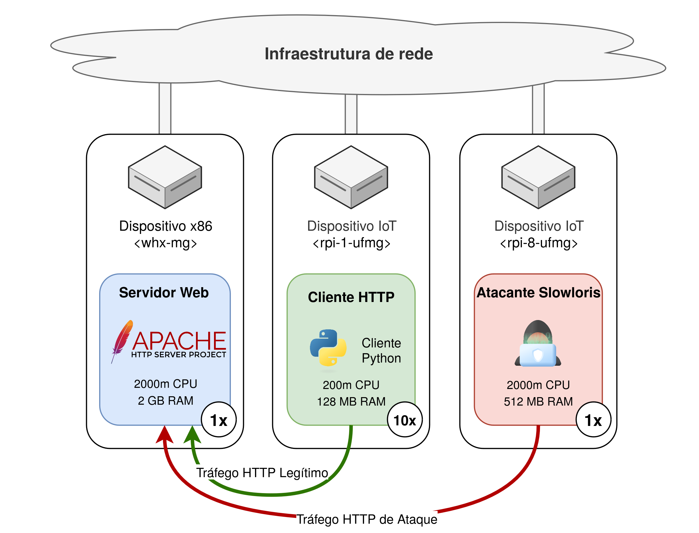

#### Fluxo / Timeline

* Duração 300 segundos
* [0-59s] Clientes legítimos realizam requisições normalmente contra o servidor Web

* [60-240s] Atacante performa um ataque durando 180s contra o servidor

* [240-300s] Apenas clientes legítimos e o servidor Web estão ativos

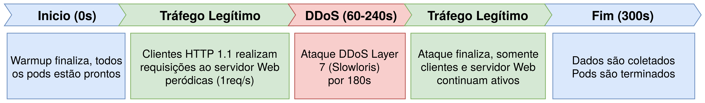

#### Dados coletados por entidade

* Todos:
  
  * Logs do script de inicialização
  
  * IPs de cada nó
  
  * Tempo de inicialização do experimento

* Servidor Web:
  
  * Captura de tráfego de rede
  
  * Logs do Apache 2

* Cliente:
  
  * CSV contando a latência de cada requisição ou um erro demarcando falha na conexão

* Atacante:
  
  * Registro (timestamp) do início e fim do ataque

#### Resultados esperados

* Funcionamento normal pré-ataque

* Experiência de acesso dos clientes degradada, demonstrada pela elevação no tempo de resposta elevado durante o ataque

* Restauração parcial ou total da conectividade dos clientes

#### Executando o cenário

1) Inspecionar o YAML que define o experimento, notando as imagens em uso, assim como as variáveis de ambiente configuradas.

2) Acessar o Portal do [MENTORED Testbed](https://portal.mentored.ccsc-research.org/), realizar login com o usuário e senhas providos na rede Cafe Expresso

3) Navegar até o projeto pré-criado, criar uma nova definição de experimento

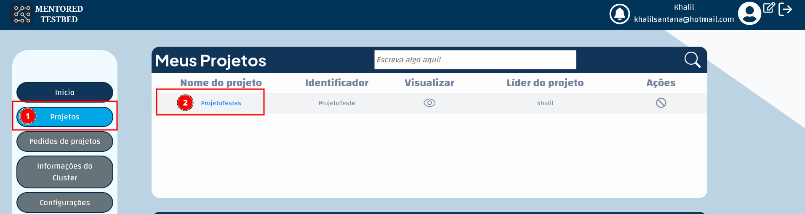

4) Crie uma nova definição de experimento

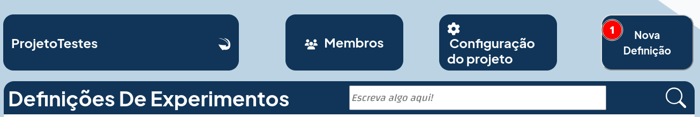

5) Crie um nome descritivo como Cenario1-Slowloris e então faça o upload do arquivo de definição de experimento provido (`Cenario1.yaml`)

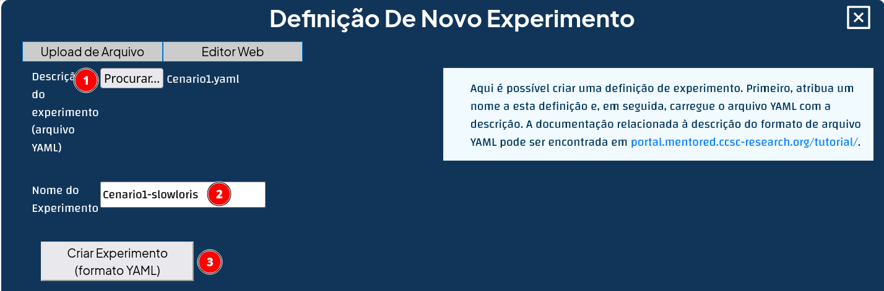

6) Você será retornado a tela anterior, então clique na definição de experimento.

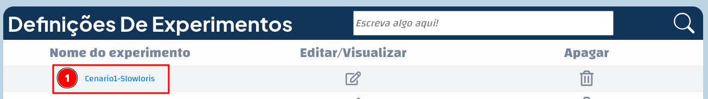

7) Instancie o experimento, no multi-cluster Karmada IoT provido e de 300 segundos de duração.


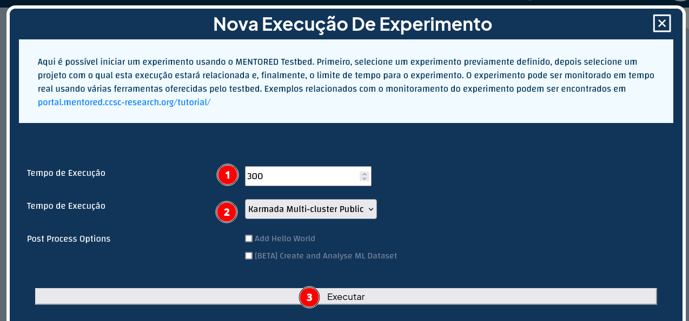

8) Aguarde o período de Warm-up finalizar (~30 segundos), e em seguida clique no ícone de monitor para inspecionar a execução do experimento. Nessa tela, busque o cliente, clique para selecionar o mesmo, e então no terminal criado execute o comando para ver o conteúdo do arquivo de log sendo gerado: `tail -f /app/results/client_delay.csv`

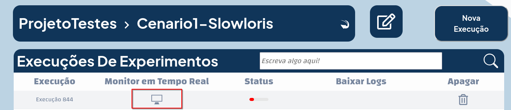

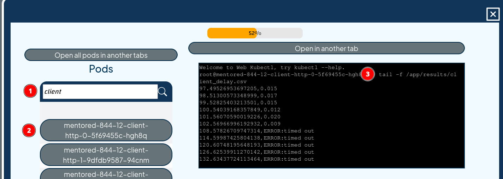

9) (Opcional) Observe os outros nós durante a execução do experimento, notando que a pasta raiz (`/`) e a pasta de resultados (`/app/results`) contem arquivos de interesse normalmente.

10) Com o experimento finalizado (demarcado pelo sinal de 100%), baixe os arquivos gerados por aquela execução. 

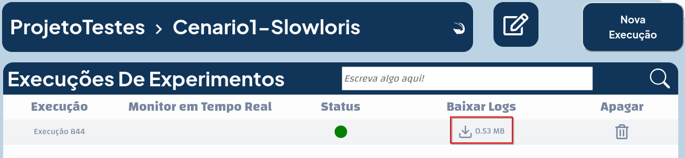


#### Analisando os dados

A estrutura do arquivo de experimentação anteriormente baixado é a seguinte:

```
.
├── attacker-http
│   └── attacker-http-0_attacker.tar
├── client-http
│   ├── client-http-0_client-static.tar
│   ├── client-http-1_client-static.tar
│   ├── client-http-2_client-static.tar
│   ├── client-http-3_client-static.tar
│   ├── client-http-4_client-static.tar
│   ├── client-http-5_client-static.tar
│   ├── client-http-6_client-static.tar
│   ├── client-http-7_client-static.tar
│   ├── client-http-8_client-static.tar
│   └── client-http-9_client-static.tar
├── experiment_logs_844.tar
├── MENTORED_IP_LIST.json
├── MENTORED_IP_LIST.yaml
├── MENTORED_READY.txt
└── server-http
    ├── server-http-0_server.tar
    └── server-http-0_tshark.tar
```

Isto é, cada entidade (node-actor) é uma pasta, e dentro desta cada réplica da entidade possui um arquivo TAR associado. Além disso os logs da aplicação principal (PID1) de cada experimento está no arquivo `experiment_logs_xxx.tar`. Por fim, o timestamp de quando o experimento finaliza o warmup está em MENTORED_READY.txt e os IPs de cada entidade estão em `MENTORED_IP_LIST.yaml`. 

Desta maneira, para analisar a efetividade do ataque basta abrir o arquivo TAR associado a um cliente, por exemplo `client/client-http-0_client-static.tar`está associado a primeira réplica do node-actor `client`. Dentro deste arquivo há dois arquivos de interesse: o `MENTORED_REGISTRY.yaml` e o `client_delay.csv`, contendo respectivamente o timestamp de início das requisições e a latência de acesso à página servida pelo servidor.

Como o cliente está programado para realizar uma requisição a cada segundo, espera-se que entre 60 à 240 segundos haja uma degradação do serviço. E de fato, por exemplo, por latências elevadas na segunda coluna de `client_delay.csv` ou mesmo erros ao acessar a página. Por exemplo, o trecho abaixo demonstra esta degradação:


|time|delay (seconds)|
|----|----|
|53.9360294342041|0.013|
|54.94859051704407|0.012|
|55.961687088012695|0.013|
|61.97136688232422|ERROR:timed out|
|67.98534560203552|ERROR:timed out|
|73.99811601638794|ERROR:timed out|
|80.00763893127441|ERROR:timed out|
|[...]|[...]|
|218.30777311325073|ERROR:timed out|
|224.31763625144958|ERROR:timed out|
|230.3426206111908|ERROR:timed out|
|235.40070056915283|4.058|
|236.41171741485596|0.010|
|237.42081928253174|0.009|


Notando que a execução iniciada no segundo 235 foi respondida 4 segundos após, ou seja, aproximadamente 240s a partir do início do experimento, coincidindo com o período onde o ataque é finalizado. Também é possível analisar os registros de cada cliente utilizando os scripts em `scripts/client-analysis` ([baseados no minicurso 2024 SBRC](https://github.com/mentoredtestbed/minicurso-sbrc-2024-testbeds)). Além disso, experimente analisar estes e co-relacionar os mesmos, como observar o tráfego de um node actor até o servidor, o início das requisições de cada nó, etc. 

Por fim, experimente repetir execuções do experimento para verificar sua reprodutibilidade, ou modifique parâmetros do experimento como o número de réplicas de entidades, seu posicionamento, o comando de ataque executado (recomenda-se a leitura das imagens Docker em `docker-images`), etc.

### Cenário 2) Ataque DDoS Layer3 volumétrico (Estimativa de 40min)

Esse cenário, descrito em `Cenario2.yaml` pretende a escalabilidade do testbed. Sua execução consistem em 4 tipos de entidades, dentre elas inúmeras replicas de clientes HTTP, simulando um cenário de maior escala.

#### Entidades

1) Servidor Web Apache: servindo uma página Web estática para clientes via HTTP 1.1

2) Clientes Web: um cliente HTTP 1.1 escrito em Python 3 executando requisições periódicas ao servidor web

3) Atacante: um node actor com quatro containers, cada um realizando ataques de bruteforce SSH contra um nó especifico. O segundo estágio deste ataque é a execução de um flood TCP SYN utilizando a ferrenta hping3 partindo dos nós comprometidos.

4) Nós vulneráveis: node actors (entidades) que simulam um dispositivo IoT qualquer com a porta 22/TCP (SSH) exposta para a internet, com uma senha simples


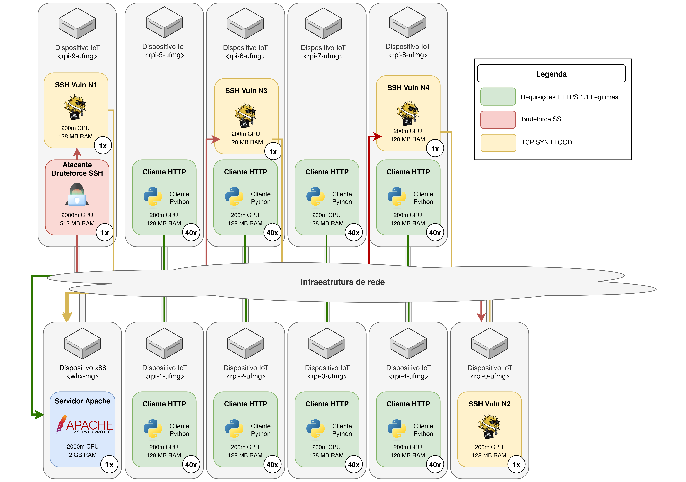

#### Fluxo / Timeline

* Duração 300 segundos
* [0-59s] Clientes legítimos realizam requisições normalmente contra o servidor Web

* [60-240s] Atacante inicia tentativas de bruteforce SSH contra os nós vulneráveis. Tais nós quando comprometidos iniciam o ataque previamente descrito por 180 segundos.

* [240-300s] Apenas clientes legítimos e o servidor Web estão ativos

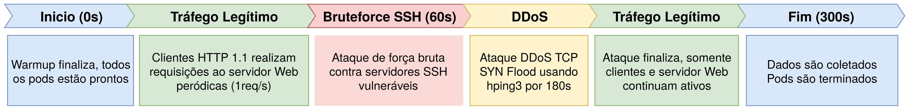

#### Dados coletados por entidade

* Todos:
  
  * Logs do script de inicialização
  
  * IPs de cada nó
  
  * Tempo de inicialização do experimento

* Servidor Web:
  
  * Captura de tráfego de rede
  
  * Logs do Apache 2

* Cliente:
  
  * CSV contando a latência de cada requisição ou um erro demarcando falha na conexão

* Atacante:
  
  * Registro (timestamp) do início e fim do ataque SSH

* Nó IoT Vulnerável:
  * Registros do inicio e fim do ataque hping3
  * Logs de acesso do servidor SSH

#### Resultados esperados

* Funcionamento normal pré-ataque

* Experiência de acesso dos clientes degradada, demonstrada pela elevação no tempo de resposta elevado durante o ataque

* Restauração parcial ou total da conectividade dos clientes

#### Executando o cenário

Siga os mesmos processos detalhados neste passo do cenário anterior, isto é, navegar pelo portal e criar uma definição de experimento, desta vez utilizando o Cenario2.yaml como base.

> [!IMPORTANT]
> Este cenário conta com 326 nós ao todo, a o processo de warmup (inicialização) do cenário demora cerca de 15-30min, seguido da execução do experimento, novamente de 300 segundos, seguido do processo de salvamento dos dados, o qual também pode demorar 15-30min. Otimizações a ambos os processos de warmup e salvamento estão sendo discutidas. Experimente a página "Informações do Cluster" no painel esquerdo durante esse periodo!

> 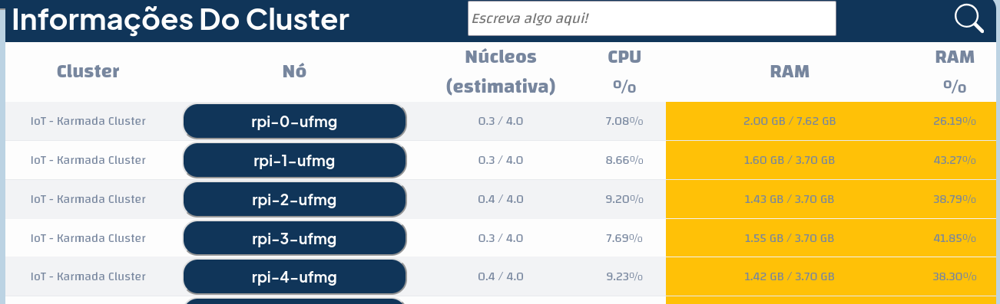

#### Análise dos resultados


Primeiramente é possivel observar que o tamanho dos registros do experimento são significativamente maiores, contando com  ~150 MB de dados comprimidos, dentre eles um arquivo de captura de tráfego de rede (`.PCAPNG`) de 2.5GB. Tal volume de dados é esperado tendo em vista a natureza volumétrica deste ataque.

Para a análise deste cenário, é recomendado o uso da ferramenta de análise em `scripts/client-analysis`, vide o `README.md` de tal pasta e siga os passos para obter os resultados da análise. Abaixo um exemplo do seu resultado esperado:

```
Processing CSV files: 100%|███████████████████████████████████████████████████████████████████████████████████████████████████████████| 40/40 [00:00<00:00, 4302.51it/s]
Average time for client response (Before 60 seconds)    : 0.043 - 29 errors
Average time for client response (60 - 240 seconds)      : 0.698 - 1991 errors
Average time for client response (After 240 seconds)     : 0.013 - 0 errors
Experiment analyzer finished
```

Neste caso, a latência média no periodo pré-ataque foi de 0.043 segundos (43ms) e existiram 29 erros de conectividade. Já durante o ataque há uma latência média de aproximadamente 700ms e foram registrados 1991 erros de conectividade. Isto é, o ataque obteve sucesso em degradar a conectividade dos clientes ao servidor Web. Por fim, após o ataque a conectividade volta ao normal, com todos os clientes sendo capazes de acessar o serviço Web e a latência normalizada.

Em seguida podemos gerar um gráfico de vazão da interface do servidor Web deste cenário utilizando as ferramentas de análise de dados do servidor. Para isso siga a documentação em `scripts/server-analysis/README.md`. Após realizar tais passos, você deve se deparar com um gráfico similar a este:

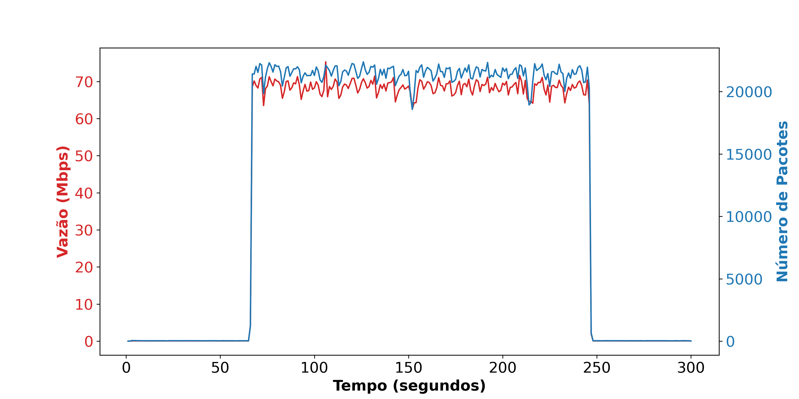


Como demonstrado por este esperimento, um grande número de nós (326) pode ser representado no MENTORED _testbed_, mesmo considerando que os dispositivos em uso são de desempenho modesto (em maioria, Raspberry Pis 4 de 4G), assim como a utilização de um único access point Wi-Fi.

### Cenário 3 - HTTP/2 RAPID RESET (Estimativa de 10min)

Esse cenário (`Cenario3.yaml`) tem como objetivo demonstrar a execução de um ataque recente no MENTORED _testbed_. Em específico, o HTTP/2 RAPID RESET, o qual é melhor explicado [neste blog post da Cloudflare](https://blog.cloudflare.com/technical-breakdown-http2-rapid-reset-ddos-attack/).


#### Entidades

1) Servidor Web Apache: servindo uma página Web estática via HTTP 1.1

2) Proxy Reverso Nginx: um servidor Nginx agindo como proxy reverso para o servidor supracitado, servindo conexões HTTP/2 via HTTPS para clientes

2) Clientes Web: um cliente HTTP/2 escrito em Python 3 executando requisições periódicas ao servidor web, com criptografia TLS (HTTPS)

3) Atacante: um node actor com quatro containers, cada um realizando ataques de bruteforce SSH contra um nó especifico. O segundo estágio deste ataque é a execução do ataque HTTP/2 RAPID RESET, em especifico [esta implementação de tal ataque](https://github.com/secengjeff/rapidresetclient).

4) Nós vulneráveis: node actors (entidades) que simulam um dispositivo IoT qualquer com a porta 22/TCP (SSH) exposta para a internet, com uma senha simples

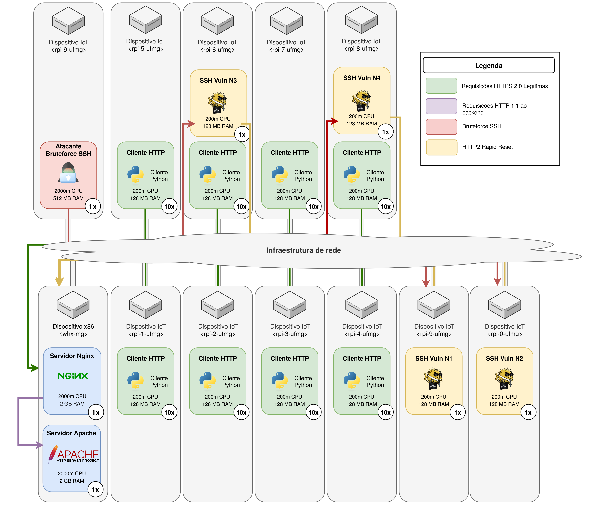


#### Fluxo / Timeline

* Duração 300 segundos
* [0-59s] Clientes legítimos realizam requisições normalmente contra o servidor Web

* [60-240s] Atacante inicia tentativas de bruteforce SSH contra os nós vulneráveis. Tais nós quando comprometidos iniciam o ataque previamente descrito por 180 segundos.

* [240-300s] Apenas clientes legítimos e o servidor Web estão ativos

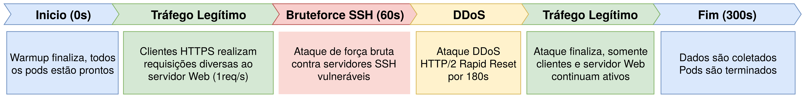

#### Dados coletados por entidade

* Todos:
  
  * Logs do script de inicialização
  
  * IPs de cada nó
  
  * Tempo de inicialização do experimento

* Servidor Web Apache:
  
  * Captura de tráfego de rede
  
  * Logs do Apache 2

* Proxy Reverso Nginx:

  * Logs de acesso
  
  * Captura de tráfego de rede

* Cliente:
  
  * CSV contando a latência de cada requisição ou um erro demarcando falha na conexão

* Atacante:
  
  * Registro (timestamp) do início e fim do ataque SSH

* Nó IoT Vulnerável:
  * Registros do inicio e fim do ataque rapidreset
  * Logs de acesso do servidor SSH

#### Executando o cenário

Siga os mesmos processos detalhados neste passo do cenário 1, isto é, navegar pelo portal e criar uma definição de experimento, desta vez utilizando o Cenario3.yaml como base.

#### Análise dos resultados

Similarmente ao cenário anterior, utilize as ferramentas de análise dados do cliente e servidor para extrair conhecimento sobre a efetividade deste ataque. Abaixo os resultados do experimento:

```
INFO - Average time for client response (Before 60 seconds)    : 0.062 - 0 errors
INFO - Average time for client response (60 - 240 seconds)      : 0.127 - 5 errors
INFO - Average time for client response (After 240 seconds)     : 0.094 - 1 errors
```

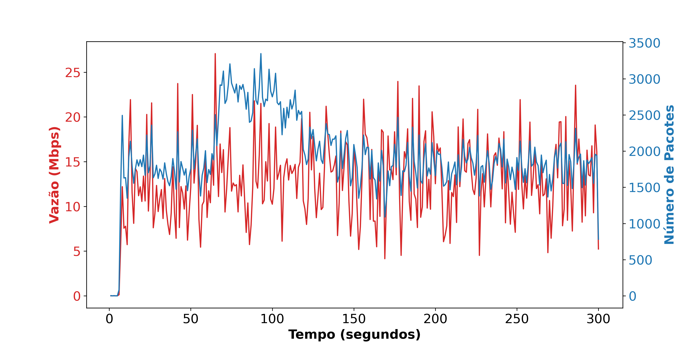

# Créditos extras

<a href="https://www.flaticon.com/free-icons/cyber-attack" title="cyber attack icons">Cyber attack icons created by Freepik - Flaticon</a>