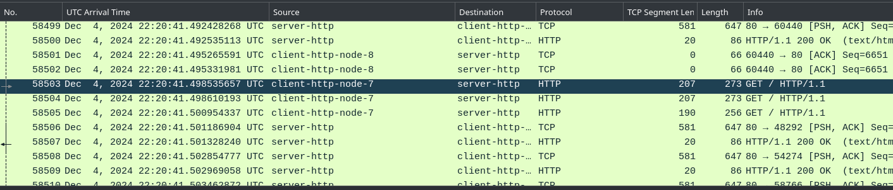
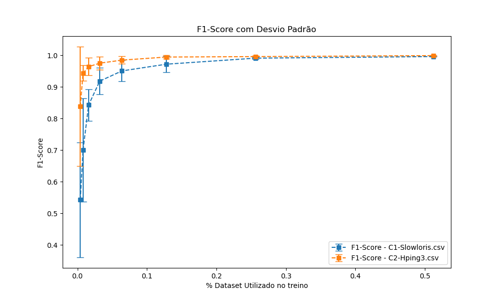
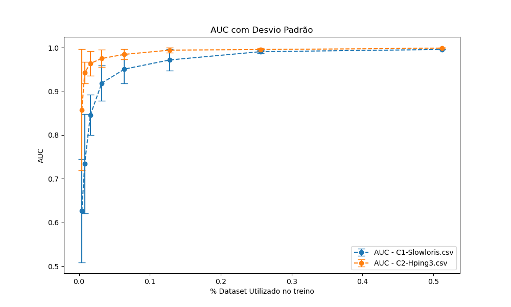
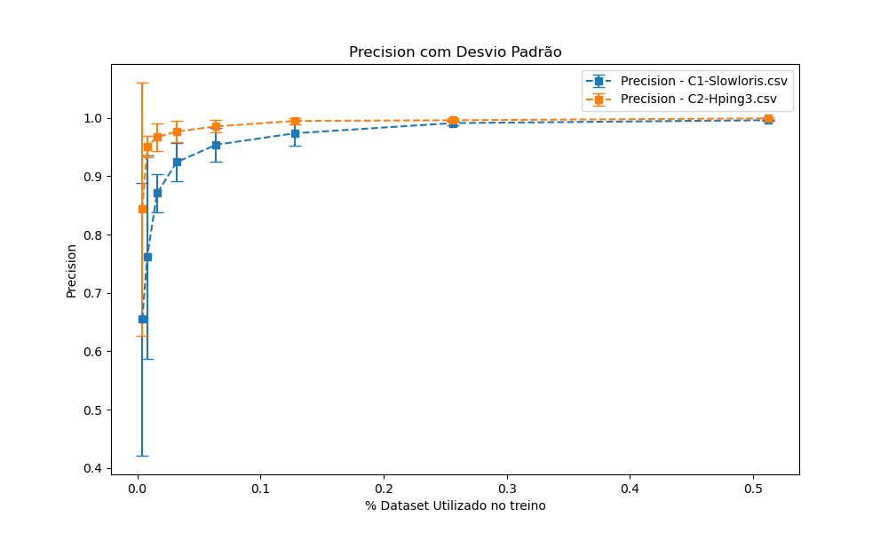
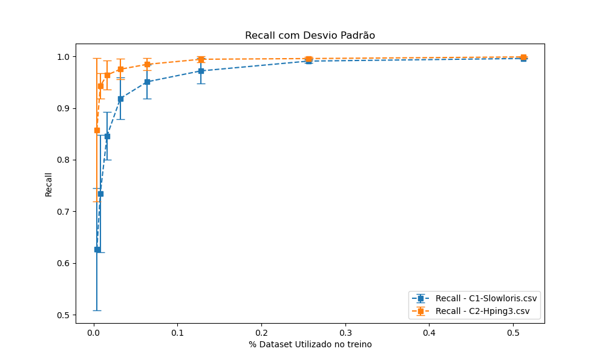

# Artigo SBRC 2025 - Dataset e guia de reprodução - MENTORED TESTBED

> [!IMPORTANT]
> A seguir são descritos os passos necessários para reproduzir e analisar os experimentos realizados no MENTORED Testbed a partir dos arquivos de definição de experimento. [Para baixar o dataset gerado utilize este link](https://drive.google.com/drive/folders/1VTac93FRHi419z4xWeK1yAwJUjUxzTqN?usp=sharing)

> [!NOTE]
> É recomendado a leitura dos [tutoriais](https://portal.mentored.ccsc-research.org/tutorial/pt/) do projeto primeiramente. Além disso recomenda-se como ferramentas o Wireshark, um editor de texto como VSCode, assim como um leitor de arquivos compactados como 7zip ou Peazip.


## Objetivos

1. Familiarizar o leitor com o MENTORED _testbed_

2. Executar experimentos pré-existentes

3. Examinar dados coletados para avaliar a efetividade dos ataques performados

### Cenário 1) Ataque Slowloris / Hello World (Estimativa de 10min)

Esse cenário, descrito em `Cenario1.yaml` pretende demonstrar o funcionamento básico do testbed, sendo de rápida execução e fácil análise.
#### Entidades

1) Servidor Web Apache: servindo uma página Web estática para clientes via HTTP 1.1

2) Clientes Web: um cliente HTTP 1.1 escrito em Python 3 executando requisições periódicas ao servidor web

3) Atacante: um nó realizando o ataque de negação de serviço Layer 7 (camada de aplicação) denominado Slowloris contra o servidor Web


#### Fluxo / Timeline

* Duração 300 segundos
* [0-59s] Clientes legítimos realizam requisições normalmente contra o servidor Web

* [60-240s] Atacante performa um ataque durando 180s contra o servidor

* [241-300s] Apenas clientes legítimos e o servidor Web estão ativos


#### Dados coletados por entidade

* Todos:
  
  * Logs do script de inicialização (arquivo `experiment_logs_<xyz>.tar`)
  
  * IPs de cada nó (`MENTORED_IP_LIST.yaml`)
  
  * Tempo de inicialização do experimento (`MENTORED_READY.txt`)

* Servidor Web:
  
  * Captura de tráfego de rede (`/app/results/packets.pcapng`, arquivo assim como arquivo `hosts` na mesma pasta)
  
  * Logs do Apache 2 (`/app/results/access.log` e `error.log` na mesma pasta)

* Cliente:

  * Registro (timestamp) do início das requisições(`/app/results/MENTORED_REGISTRY.yaml`)
  
  * CSV contando a latência de cada requisição ou um erro demarcando falha na conexão (`/app/results/client_delay.csv`)

* Atacante:
  
  * Registro (timestamp) do início e fim do ataque (`/app/results/MENTORED_REGISTRY.yaml`)

#### Resultados esperados

* Funcionamento normal pré-ataque

* Experiência de acesso dos clientes degradada, demonstrada pela elevação no tempo de resposta elevado durante o ataque

* Restauração parcial ou total da conectividade dos clientes

#### Executando o cenário

1) Inspecionar o YAML que define o experimento, notando as imagens em uso, assim como as variáveis de ambiente configuradas.

2) Acessar o Portal do [MENTORED Testbed](https://portal.mentored.ccsc-research.org/), realizar login com o usuário e senhas providos na rede Cafe Expresso

3) Navegar até o projeto pré-criado, criar uma nova definição de experimento


4) Crie uma nova definição de experimento


5) Crie um nome descritivo como Cenario1-Slowloris e então faça o upload do arquivo de definição de experimento provido (`Cenario1.yaml`)


6) Você será retornado a tela anterior, então clique na definição de experimento.


7) Instancie o experimento, no multi-cluster Karmada IoT provido e de 300 segundos de duração.


8) Aguarde o período de Warm-up finalizar (~30 segundos), e em seguida clique no ícone de monitor para inspecionar a execução do experimento. Nessa tela, busque o cliente, clique para selecionar o mesmo, e então no terminal criado execute o comando para ver o conteúdo do arquivo de log sendo gerado: `tail -f /app/results/client_delay.csv`


9) (Opcional) Observe os outros nós durante a execução do experimento, notando que a pasta raiz (`/`) e a pasta de resultados (`/app/results`) contem arquivos de interesse normalmente.

10) Com o experimento finalizado (demarcado pelo sinal de 100%), baixe os arquivos gerados por aquela execução. 


#### Analisando os dados

A estrutura do arquivo de experimentação anteriormente baixado é a seguinte:

```
.
├── attacker-http
│   └── attacker-http-0_attacker.tar
├── client-http
│   ├── client-http-0_client-static.tar
│   ├── client-http-1_client-static.tar
│   ├── client-http-2_client-static.tar
│   ├── client-http-3_client-static.tar
│   ├── client-http-4_client-static.tar
│   ├── client-http-5_client-static.tar
│   ├── client-http-6_client-static.tar
│   ├── client-http-7_client-static.tar
│   ├── client-http-8_client-static.tar
│   └── client-http-9_client-static.tar
├── experiment_logs_844.tar
├── MENTORED_IP_LIST.json
├── MENTORED_IP_LIST.yaml
├── MENTORED_READY.txt
└── server-http
    ├── server-http-0_server.tar
    └── server-http-0_tshark.tar
```

Isto é, cada entidade (node-actor) é uma pasta, e dentro desta cada réplica da entidade possui um arquivo TAR associado. Além disso os logs da aplicação principal (PID1) de cada experimento está no arquivo `experiment_logs_xxx.tar`. Por fim, o timestamp de quando o experimento finaliza o warmup está em MENTORED_READY.txt e os IPs de cada entidade estão em `MENTORED_IP_LIST.yaml`. 

Desta maneira, para analisar a efetividade do ataque basta abrir o arquivo TAR associado a um cliente, por exemplo `client/client-http-0_client-static.tar`está associado a primeira réplica do node-actor `client`. Dentro deste arquivo há dois arquivos de interesse: o `MENTORED_REGISTRY.yaml` e o `client_delay.csv`, contendo respectivamente o timestamp de início das requisições e a latência de acesso à página servida pelo servidor.

Como o cliente está programado para realizar uma requisição a cada segundo, espera-se que entre 60 à 240 segundos haja uma degradação do serviço. E de fato, por exemplo, por latências elevadas na segunda coluna de `client_delay.csv` ou mesmo erros ao acessar a página. Por exemplo, o trecho abaixo demonstra esta degradação:


|time|delay (seconds)|
|----|----|
|53.9360294342041|0.013|
|54.94859051704407|0.012|
|55.961687088012695|0.013|
|61.97136688232422|ERROR:timed out|
|67.98534560203552|ERROR:timed out|
|73.99811601638794|ERROR:timed out|
|80.00763893127441|ERROR:timed out|
|[...]|[...]|
|218.30777311325073|ERROR:timed out|
|224.31763625144958|ERROR:timed out|
|230.3426206111908|ERROR:timed out|
|235.40070056915283|4.058|
|236.41171741485596|0.010|
|237.42081928253174|0.009|


Notando que a execução iniciada no segundo 235 foi respondida 4 segundos após, ou seja, aproximadamente 240s a partir do início do experimento, coincidindo com o período onde o ataque é finalizado. Também é possível analisar os registros de cada cliente utilizando os scripts em `scripts/client-analysis` dentro deste repositório. Além disso, experimente analisar estes e co-relacionar os mesmos, como observar o tráfego de um node actor até o servidor, o início das requisições de cada nó, etc. É importante notar que multiplas execuções podem possuir uma efetividade de negação de serviço variada, apesar disso é possivel confirmar que o ataque inicia no momento desejado por meio da análise dos registros e da captura de tráfego de rede no servidor web. Por exemplo, algumas execuções resultam em negação de serviço por volta dos 110 segundos.

Por fim, experimente repetir execuções do experimento para verificar sua reprodutibilidade, ou modifique parâmetros do experimento como o número de réplicas de entidades, seu posicionamento, o comando de ataque executado (recomenda-se a leitura das imagens Docker em `docker-images`), etc.

### Cenário 2) Ataque DDoS Layer3 volumétrico (Estimativa de 40min)

Esse cenário, descrito em `Cenario2.yaml` pretende a escalabilidade do testbed. Sua execução consistem em 4 tipos de entidades, dentre elas inúmeras réplicas de clientes HTTP, simulando um cenário de maior escala.

#### Entidades

1) Servidor Web Apache: servindo uma página Web estática para clientes via HTTP 1.1

2) Clientes Web: um cliente HTTP 1.1 escrito em Python 3 executando requisições periódicas ao servidor web

3) Atacante: um node actor com quatro containers, cada um realizando ataques de bruteforce SSH contra um nó especifico. O segundo estágio deste ataque é a execução de um flood TCP SYN utilizando a ferrenta hping3 partindo dos nós comprometidos.

4) Nós vulneráveis: node actors (entidades) que simulam um dispositivo IoT qualquer com a porta 22/TCP (SSH) exposta para a internet, com uma senha simples


#### Fluxo / Timeline

* Duração 300 segundos
* [0-59s] Clientes legítimos realizam requisições normalmente contra o servidor Web

* [60-240s] Atacante inicia tentativas de bruteforce SSH contra os nós vulneráveis. Tais nós quando comprometidos iniciam o ataque previamente descrito por 180 segundos.

* [241-300s] Apenas clientes legítimos e o servidor Web estão ativos


#### Dados coletados por entidade

* Todos:
  
  * Logs do script de inicialização (arquivo `experiment_logs_<xyz>.tar`)
  
  * IPs de cada nó (`MENTORED_IP_LIST.yaml`)
  
  * Tempo de inicialização do experimento (`MENTORED_READY.txt`)

* Servidor Web:
  
  * Captura de tráfego de rede (`/app/results/packets.pcapng`, arquivo assim como arquivo `hosts` na mesma pasta)
  
  * Logs do Apache 2 (`/app/results/access.log` e `error.log` na mesma pasta)

* Cliente:

  * Registro (timestamp) do início das requisições(`/app/results/MENTORED_REGISTRY.yaml`)
  
  * CSV contando a latência de cada requisição ou um erro demarcando falha na conexão (`/app/results/client_delay.csv`)

* Atacante:
  
  * Registro (timestamp) do início e fim do ataque SSH (`/app/results/MENTORED_REGISTRY.yaml`)

* Nó IoT Vulnerável:

  * Registros do inicio e fim do ataque hping3 (`/app/results/MENTORED_REGISTRY.yaml`)

  * Logs de acesso do servidor SSH (`/app/results/sshd.log`)

#### Resultados esperados

* Funcionamento normal pré-ataque

* Experiência de acesso dos clientes degradada, demonstrada pela elevação no tempo de resposta elevado durante o ataque

* Restauração parcial ou total da conectividade dos clientes

#### Executando o cenário

Siga os mesmos processos detalhados neste passo do cenário anterior, isto é, navegar pelo portal e criar uma definição de experimento, desta vez utilizando o Cenario2.yaml como base.

Durante o experimento, isto é, após o final do warmup, analise o conteúdo dos arquivos listados na seção Dados Coletados por Entidade. Use comandos como `tail -f /<caminho>` para acompanhar o conteúdo dos arquivos em tempo real ou monitore os processos ativos de uma entidade, como nós SSH vulneráveis, utilizando `watch ps aux`. Alguns outros comandos de interesse são listados abaixo podem ser executados em um cliente por exemplo:


```bash
cat /MENTORED_READY # timestmap inicio do experimento
cat /etc/hosts # registros DNS fixos realizados automaticamente
ping -c3 server-http # teste de conectividade ao servidor via ICMP
curl -vvv http://server-http # tentativa de requisição da página web na raiz
curl -v http://server-http/home?min_words=1&max_words=7478 # solicitação de uma página com conteúdo de tamanho variável
```


> [!IMPORTANT]
> Este cenário conta com 326 nós ao todo, a o processo de warmup (inicialização) do cenário demora cerca de 15-30min, seguido da execução do experimento, novamente de 300 segundos, seguido do processo de salvamento dos dados, o qual também pode demorar 15-30min. Otimizações a ambos os processos de warmup e salvamento estão sendo discutidas. Experimente a página "Informações do Cluster" no painel esquerdo durante esse periodo!


> 

#### Análise dos resultados


Primeiramente é possivel observar que o tamanho dos registros do experimento são significativamente maiores, contando com  ~150 MB de dados comprimidos, dentre eles um arquivo de captura de tráfego de rede (`.PCAPNG`) de 2.5GB. Tal volume de dados é esperado tendo em vista a natureza volumétrica deste ataque.

> [!IMPORTANT]
> Os comandos abaixo presumem um ambiente Linux com Python3, para essa finalidade uma imagem de container para as ferramentas de análise é provida no passo 3. Usuário avançados podem também optar por instalar as dependencias Python3 diretamente num ambiente Linux como Ubuntu 24.04. Caso esteja utilizando o Windows 10/11, recomenda-se utilizar o WSL2 com o Ubuntu 24.04.


1) Baixe o arquivo `.tar.gz` e copie o mesmo para esta pasta (adaptando o comando abaixo)

```bash
git clone git@github.com:KhalilSantana/dataset-mentored-iot-2024.git
cd dataset-mentored-iot-2024
git pull
MY_ATTACK_START=60
MY_ATTACK_END=240
MY_EXP_FILE=experiment_XXXX.tar.gz
cp ~/Downloads/$MY_EXP_FILE .
```

2) Execute o script de análise

> [!NOTE]
> Abaixo um exemplo utilizando a imagem Docker pré-construída


```bash
sudo docker run --rm -it \
    -v .:/app ghcr.io/khalilsantana/dataset-mentored-iot-2024 \
    python3 /app/scripts/clients-analysis/client_metrics.py \
    ../../$MY_EXP_FILE -a $MY_ATTACK_START -p $MY_ATTACK_END
```

3) Observe os resultados, a exemplo abaixo:

```
Processing CSV files: 100%|███████████████████████████████████████████████████████████████████████████████████████████████████████████| 40/40 [00:00<00:00, 4302.51it/s]
Average time for client response (Before 60 seconds)    : 0.043 - 29 errors
Average time for client response (60 - 240 seconds)      : 0.698 - 1991 errors
Average time for client response (After 240 seconds)     : 0.013 - 0 errors
Experiment analyzer finished
```

Neste caso, a latência média no periodo pré-ataque foi de 0.043 segundos (43ms) e existiram 29 erros de conectividade. Já durante o ataque há uma latência média de aproximadamente 700ms e foram registrados 1991 erros de conectividade. Isto é, o ataque obteve sucesso em degradar a conectividade dos clientes ao servidor Web. Por fim, após o ataque a conectividade volta ao normal, com todos os clientes sendo capazes de acessar o serviço Web e a latência normalizada.

Em seguida podemos gerar um gráfico de vazão da interface do servidor Web deste cenário utilizando as ferramentas de análise de dados do servidor. 

> [!IMPORTANT]
> Os comandos abaixo presumem um ambiente Linux com Python3, para essa finalidade uma imagem de container para as ferramentas de análise é provida no passo 3. Usuário avançados podem também optar por instalar as dependencias Python3 diretamente num ambiente Linux como Ubuntu 24.04. Caso esteja utilizando o Windows 10/11, recomenda-se utilizar o WSL2 com o Ubuntu 24.04.


1) Dentro da pasta do repostório do roteiro, certifique-se que o arquivo do experimento está presente e estas variáveis de ambiente estão configuradas

```bash
MY_EXP_DURATION=300
MY_EXP_FILE=experiment_XXXX.tar.gz
cp ~/Downloads/$MY_EXP_FILE .
```

2) Execute o script de análise de dados de servidor

> [!NOTE] 
> Abaixo um exemplo utilizando a imagem Docker pré-construída


```bash
sudo docker run --rm -it \
    -v .:/app ghcr.io/khalilsantana/dataset-mentored-iot-2024 \
    /app/scripts/server-analysis/experiment_analyzer.sh ../../$MY_EXP_FILE $MY_EXP_DURATION
```

3) Observe os resultados, em `scripts/server-analysis/output_${TIMESTAMP}.png`


Caso deseje, examine o arquivo de captura de pacotes manualmente no Wireshark, recomenda-se utilizar do arquivo `hosts`, o qual contem o mapeamento DNS. Para isso, copie tal arquivo (contido na mesma pasta do `packets.pcapng`) para seu diretório de configuração do Wireshark (`~/.config/wireshark/` no Linux e `%appdata%\Wireshark\` no Windows). Em seguida abra a captura de pacotes e ative a resolução de DNS em View -> Name resolution -> Resolve Network Addresses. Ao realizar tal processo a captura de pacotes será mais legivel ao incluir o nome do node actor, como exibido abaixo:




Como demonstrado por este esperimento, um grande número de nós (326) pode ser representado no MENTORED _testbed_, mesmo considerando que os dispositivos em uso são de desempenho modesto (em maioria, Raspberry Pis 4 de 4G), assim como a utilização de um único access point Wi-Fi.


# Métricas de Machine Learning

A partir dos dados coletados destes experimentos, foram elaborados modelos de inteligência artificial para detectar o tráfego malicioso e legítmo. Tais modelos de inteligência artificial são mais bem detalhados no artigo pertinente a este _dataset_. Abaixo são descritas as principais métricas como F1-score, Precision e Recall dos modelos de Machine Learning desenvolvidos utilizando a metodologia estabelecida no artigo.


## F1 Score com desvio padrão


## AUC com desvio padrão



## Precisão com desvio padrão


## Recall com desvio padrão



## Dados brutos/datapoints das métricas de treinamento

Veja os arquivos `.csv` na pasta "ML" do dataset. Abaixo um sumário dos dados (arredondados) dos modelos treinados em cada experimento:

|   Train data ratio |   AUC |   STD AUC |   F1-Score |   STD F1-Score |   Precision |   STD Precision |   Recall |   STD Recall | Source           |
|-------------------:|------:|----------:|-----------:|---------------:|------------:|----------------:|---------:|-------------:|:-----------------|
|              0.004 | 0.627 |     0.118 |      0.543 |          0.182 |       0.655 |           0.234 |    0.627 |        0.118 | C1-Slowloris.csv |
|              0.008 | 0.735 |     0.113 |      0.7   |          0.164 |       0.762 |           0.174 |    0.735 |        0.113 | C1-Slowloris.csv |
|              0.016 | 0.846 |     0.046 |      0.843 |          0.05  |       0.871 |           0.033 |    0.846 |        0.046 | C1-Slowloris.csv |
|              0.032 | 0.919 |     0.041 |      0.918 |          0.042 |       0.924 |           0.033 |    0.919 |        0.041 | C1-Slowloris.csv |
|              0.064 | 0.951 |     0.033 |      0.951 |          0.033 |       0.954 |           0.029 |    0.951 |        0.033 | C1-Slowloris.csv |
|              0.128 | 0.972 |     0.025 |      0.972 |          0.025 |       0.974 |           0.022 |    0.972 |        0.025 | C1-Slowloris.csv |
|              0.256 | 0.991 |     0.004 |      0.991 |          0.004 |       0.991 |           0.004 |    0.991 |        0.004 | C1-Slowloris.csv |
|              0.512 | 0.996 |     0.001 |      0.996 |          0.001 |       0.996 |           0.001 |    0.996 |        0.001 | C1-Slowloris.csv |

|   Train data ratio |   AUC |   STD AUC |   F1-Score |   STD F1-Score |   Precision |   STD Precision |   Recall |   STD Recall | Source        |
|-------------------:|------:|----------:|-----------:|---------------:|------------:|----------------:|---------:|-------------:|:--------------|
|              0.004 | 0.858 |     0.139 |      0.838 |          0.189 |       0.844 |           0.217 |    0.858 |        0.139 | C2-Hping3.csv |
|              0.008 | 0.943 |     0.025 |      0.943 |          0.025 |       0.951 |           0.018 |    0.943 |        0.025 | C2-Hping3.csv |
|              0.016 | 0.964 |     0.028 |      0.964 |          0.028 |       0.967 |           0.023 |    0.964 |        0.028 | C2-Hping3.csv |
|              0.032 | 0.975 |     0.02  |      0.975 |          0.02  |       0.977 |           0.019 |    0.975 |        0.02  | C2-Hping3.csv |
|              0.064 | 0.985 |     0.011 |      0.985 |          0.012 |       0.985 |           0.011 |    0.985 |        0.011 | C2-Hping3.csv |
|              0.128 | 0.994 |     0.006 |      0.994 |          0.006 |       0.995 |           0.005 |    0.994 |        0.006 | C2-Hping3.csv |
|              0.256 | 0.996 |     0.003 |      0.996 |          0.003 |       0.996 |           0.003 |    0.996 |        0.003 | C2-Hping3.csv |
|              0.512 | 0.999 |     0.001 |      0.999 |          0.001 |       0.999 |           0.001 |    0.999 |        0.001 | C2-Hping3.csv |

# Créditos extras

<a href="https://www.flaticon.com/free-icons/cyber-attack" title="cyber attack icons">Cyber attack icons created by Freepik - Flaticon</a>